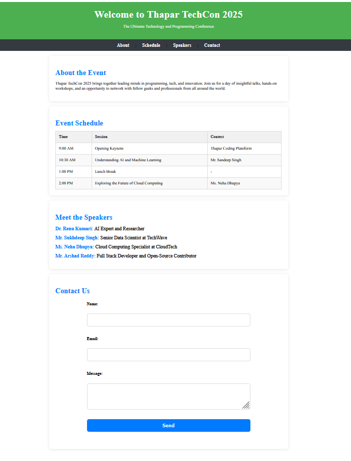

  

# Thapar TechCon 2025 🎉

Welcome to the Thapar TechCon 2025, the ultimate technology and programming conference! This event brings together leading minds in the world of programming, tech, and innovation.

## About the Event 🤖

Thapar TechCon 2025 is a one-day event that promises to be a hub of insightful talks, hands-on workshops, and unparalleled networking opportunities. Join us as we explore the latest advancements in the fields of AI, machine learning, cloud computing, and more.

## Event Schedule 📅

| Time | Session | Contest |
| --- | --- | --- |
| 9:00 AM | Opening Keynote | Thapar Coding Platform |
| 10:30 AM | Understanding AI and Machine Learning | Mr. Sandeep Singh |
| 1:00 PM | Lunch Break | - |
| 2:00 PM | Exploring the Future of Cloud Computing | Ms. Neha Dhupya |

## Meet the Speakers 🧑‍💻

  

- **Dr. Renu Kumari**: AI Expert and Researcher
- **Mr. Sukhdeep Singh**: Senior Data Scientist at TechWave
- **Ms. Neha Dhupya**: Cloud Computing Specialist at CloudTech
- **Mr. Arshad Reddy**: Full Stack Developer and Open-Source Contributor

## Contact Us 📩

Name:
<input type="text" id="name" name="name">

Email:
<input type="email" id="email" name="email">

Message:
<textarea id="message" name="message" rows="4"></textarea>

<button type="submit">Send</button>

## Join Us! 🎉

Don't miss this opportunity to connect with fellow geeks and professionals from around the world. Register now and be a part of Thapar TechCon 2025!

  <a href="#" class="btn">Register Now</a>

